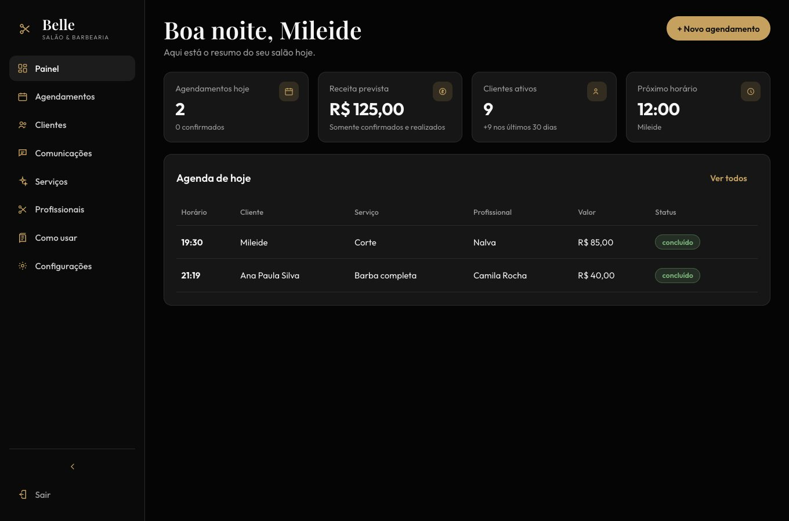
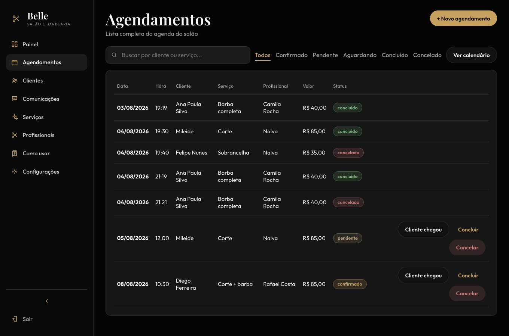
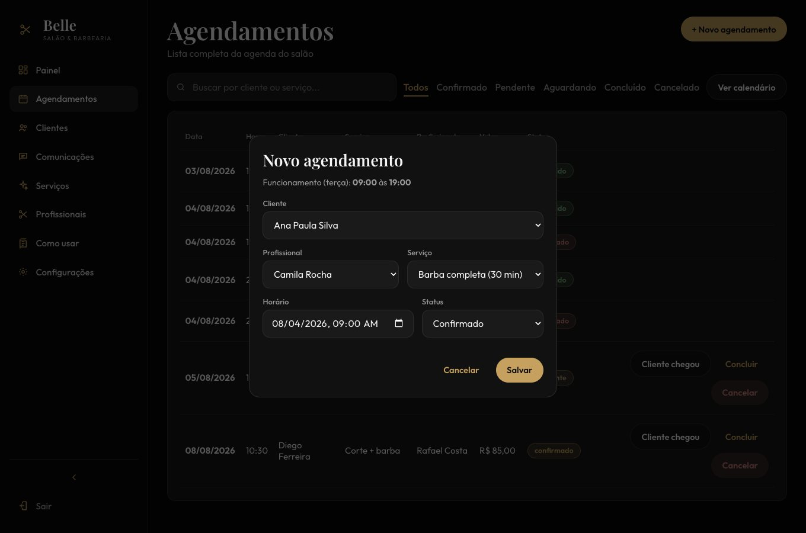
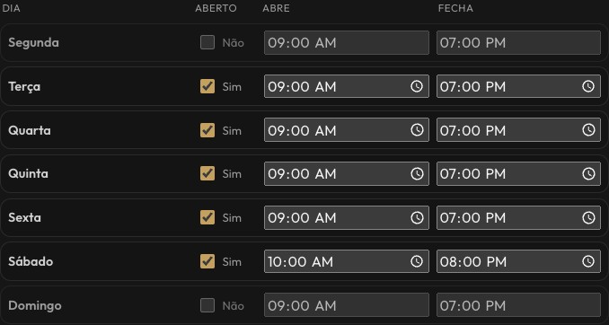
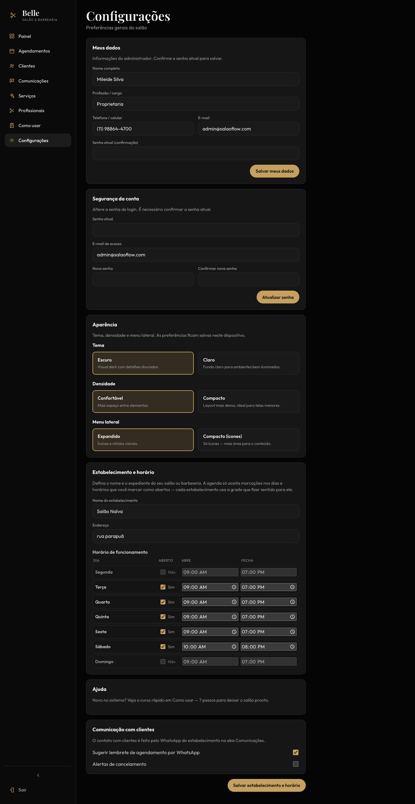
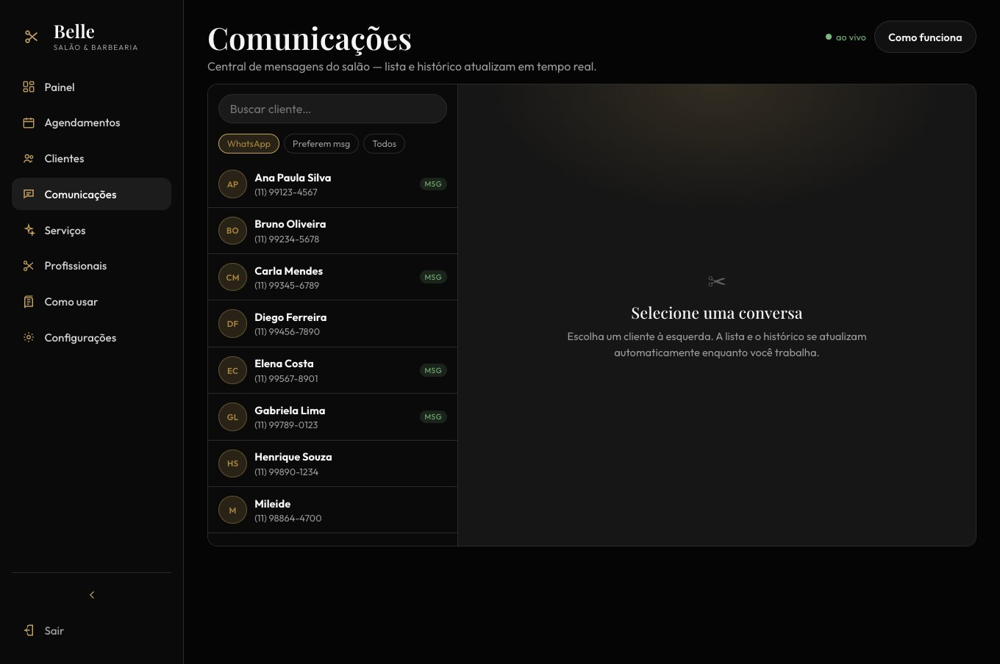
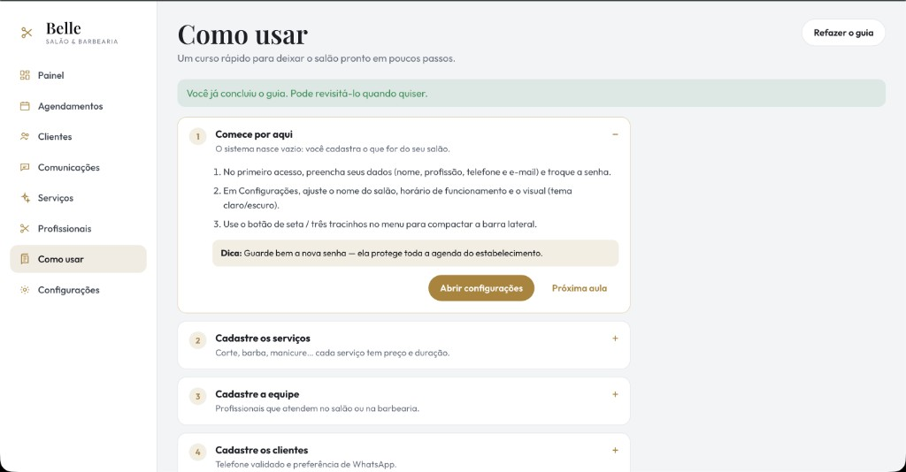

# BeautyFlow — Sistema de Agendamento para Salão de Beleza

Projeto de Extensão I — Análise e Desenvolvimento de Sistemas (Anhanguera).

API NestJS + Prisma + PostgreSQL e frontend React (Vite) com login seguro.

## Telas

### Painel



### Agenda (status e ações)

Lista com filtros (incluindo **Aguardando**), ações **Cliente chegou**, **Concluir** e **Cancelar**.



### Novo agendamento (respeita o expediente)

O modal mostra o horário de funcionamento do dia escolhido e a API bloqueia fora desse intervalo.



### Configuração de horário (grade semanal)

Cada estabelecimento define, dia a dia, se está aberto e o horário de abrir/fechar.





### Comunicações (WhatsApp / mensagens)

Central de mensagens com lista de clientes e histórico local.



### Como usar



## Stack

- NestJS 10 + Prisma 5 + PostgreSQL
- React + Vite + TypeScript
- JWT em cookie **httpOnly** (não usa localStorage)
- bcrypt, Helmet, rate limit, bloqueio por tentativas

## Setup

```bash
cp .env.example .env
# JWT_SECRET já vem no exemplo; ajuste se quiser

# Banco local (Docker) — porta 5433 para não conflitar com Postgres do sistema
docker compose up -d

yarn install
yarn prisma:migrate
yarn prisma:seed

# API
yarn start:dev

# Frontend (outro terminal)
yarn start:web
```

Credenciais do Postgres Docker: usuário `salao` / senha `salao123` / db `salao_db` (porta `5433`).

- Login: http://localhost:5173/login
- API: http://localhost:3000/api
- Swagger: http://localhost:3000/docs

O Vite faz proxy de `/api` → `http://localhost:3000`, permitindo cookies same-origin.

### Usuários do seed

| Papel | E-mail | Senha |
|-------|--------|-------|
| ADMIN | `admin@salaoflow.com` | `senhaSegura123` |
| PROFESSIONAL | `vitor@salaoflow.com` | `senhaSegura123` |

## Segurança do login

| Camada | Proteção |
|--------|----------|
| Cookie | `httpOnly`, `sameSite=lax`, `secure` em produção |
| Token | JWT — não exposto ao JavaScript do browser |
| Senha | bcrypt + limite de tamanho (anti DoS) |
| Timing | comparação bcrypt mesmo quando o e-mail não existe |
| Tentativas | 5 falhas → bloqueio de 15 minutos |
| Rate limit | máx. 5 logins / minuto por IP |
| Headers | Helmet + CORS restrito ao frontend |
| UX | mensagens genéricas, limpa senha após erro |

## Endpoints de auth

| Método | Rota | Acesso |
|--------|------|--------|
| POST | `/api/auth/login` | Público (cookie) |
| POST | `/api/auth/logout` | Público (limpa cookie) |
| GET | `/api/auth/me` | Autenticado |

## Scripts

```bash
yarn start:dev   # API
yarn start:web   # Frontend
yarn build       # API
yarn build:web   # Frontend
yarn prisma:seed
```
